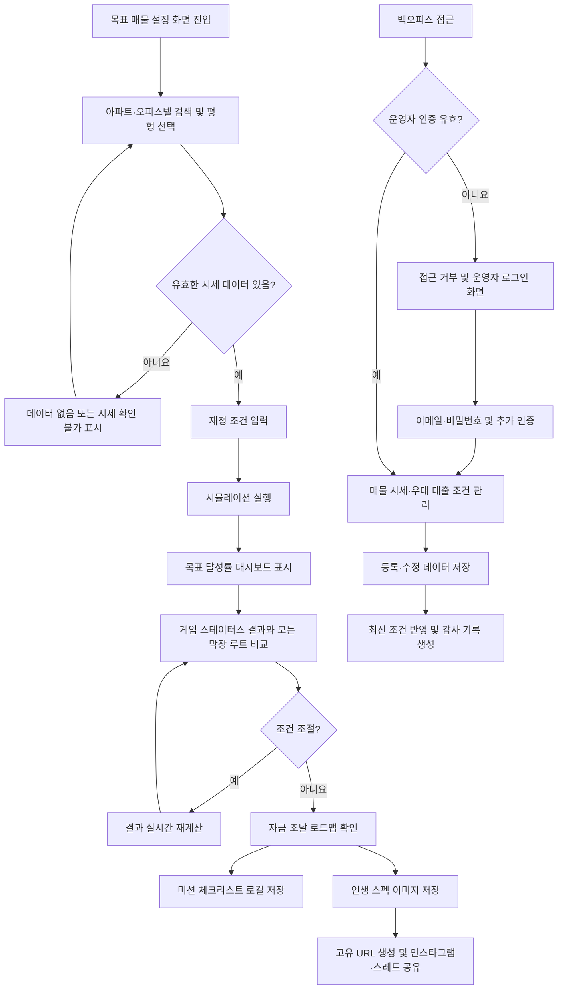

<!-- prd/03-user-flows.md · 뭐해야집사냐? · v1 -->
# 사용자 플로우

> 이 파일의 역할: 화면 단위 해피패스·역할별 플로우·예외 플로우를 정의한다. 화면 상세는 `05-screens.md`, 기능 요구는 `04-functional-requirements.md` 를 본다.

## 핵심 해피패스

**FLOW-001** 목표 주택 시뮬레이션 생성·저장·공유 (비로그인 방문자)

1. 목표 매물 설정 화면에 진입하여 검색창을 선택하면 대표 랜드마크 아파트 추천 키워드와 매물 검색 입력란이 표시되어야 한다.
2. 추천 키워드를 선택하거나 아파트·오피스텔을 검색하여 매물을 선택하면 해당 매물에서 선택 가능한 평형 목록이 표시되어야 한다.
3. 평형을 선택하면 목표 매물과 정규화된 실거래가 시세가 연결된 목표 설정 완료 상태가 되어야 한다.
4. 재정 조건 입력 화면에서 현재 보유 자산, 연 소득, 월 저축 가능 금액과 보유 대출 현황을 입력하고 시뮬레이션을 실행하면 유효성 검증을 통과한 재정 조건이 저장되어야 한다.
5. 목표 달성률 대시보드 화면으로 이동하면 목표 매물 시세, 부족 자금, 예상 대출 한도, 현실적인 목표 달성 예상 기간 및 목표 달성률이 표시되어야 한다.
6. 결과 피드백 화면을 확인하면 계산 결과에 대응하는 2D 픽셀 도트 캐릭터, 절망 지수, 보유 자산 스펙, 생존 연한 능력치 그래프, 장착 장비 및 레이드 시스템 메시지가 표시되어야 한다.
7. 같은 화면을 스크롤하면 로또, 코인, 대기업 노예, 인생 리셋을 포함한 모든 막장 우회 시뮬레이션의 상세 수치와 연산 결과가 비교 가능한 상태로 표시되어야 한다.
8. 결과 화면에서 소득, 월 저축액 또는 아파트 평형을 조절하면 부족 자금, 대출 한도, 예상 기간, 캐릭터 상태 및 모든 우회 시나리오가 변경 조건으로 즉시 갱신되어야 한다.
9. 맞춤형 자금 조달 로드맵 상세 화면으로 이동하면 가용 자산과 소득에 맞는 자금 조달 시나리오, 청약·정부 지원 대출 우대 조건, 예상 달성 기간 및 주간·월간 미션이 표시되어야 한다.
10. 결과 이미지 저장을 선택하면 현재 결과의 캐릭터, 능력치, 장착 장비 및 시스템 메시지를 포함한 인생 스펙 이미지가 생성되어 기기에 저장 가능한 상태가 되어야 한다.
11. 공유를 선택하면 추측 불가능한 접근 토큰이 포함된 고유 URL이 생성되고, 비로그인 상태로 인스타그램 또는 스레드 공유 인터페이스에 이미지와 URL을 전달할 수 있어야 한다.

**수락 시나리오**

- **Given** 비로그인 방문자가 유효한 목표 매물·평형과 재정 조건을 입력했고
- **When** 시뮬레이션을 실행한 뒤 결과 조건을 조절하고 저장 또는 공유를 선택하면
- **Then** 시스템은 로그인이나 가입을 요구하지 않고 갱신된 결과, 로드맵, 저장 이미지 및 고유 URL을 제공해야 한다.

## 역할별 주요 플로우

**FLOW-002** 미션 체크리스트 실행 및 재방문 (비로그인 방문자)

1. 맞춤형 자금 조달 로드맵 상세 화면에서 실행 체크리스트를 선택하면 목표 조건에 대응하는 주간·월간 미션과 단계별 준비 사항이 표시되어야 한다.
2. 실행 체크리스트 화면에서 미션의 완료 여부를 변경하면 해당 브라우저의 로컬 저장 영역에 즉시 저장되고 완료 상태가 화면에 반영되어야 한다.
3. 최초 저장 시 브라우저 데이터 삭제, 저장 차단 또는 기기 변경 시 체크 상태를 복구할 수 없다는 고지가 표시되어야 한다.
4. 같은 브라우저로 실행 체크리스트 화면에 다시 진입하면 저장된 미션 완료 상태가 복원되어야 한다.

**수락 시나리오**

- **Given** 비로그인 방문자가 로컬 저장을 허용한 브라우저에서 미션 완료 상태를 변경했고
- **When** 같은 브라우저로 해당 체크리스트에 다시 진입하면
- **Then** 시스템은 계정 인증 없이 저장된 완료 상태를 복원해야 한다.

**FLOW-003** 매물 시세 및 우대 대출 조건 관리 (운영자)

1. 백오피스 로그인 화면에서 검증된 이메일과 비밀번호를 제출하면 기본 자격 증명 검증 후 추가 인증 입력 화면이 표시되어야 한다.
2. 추가 인증을 완료하면 유효한 운영자 세션이 생성되고 부동산 매물 시세 및 우대 대출 조건 관리 화면에 접근 가능한 상태가 되어야 한다.
3. 관리 화면에서 매물 시세 또는 우대 대출 조건 영역을 선택하면 기존 데이터를 조회·검색할 수 있는 목록이 표시되어야 한다.
4. 등록 또는 수정할 항목을 선택하여 매물 식별 정보, 평형별 시세 또는 대출 자격·한도·우대 조건을 입력하고 저장하면 검증된 최신 데이터로 반영되어야 한다.
5. 저장 완료 후 관리 화면에는 반영된 값과 적용 상태가 표시되고, 변경 행위는 수행 운영자와 변경 시각을 포함한 감사 기록으로 남아야 한다.
6. 이후 시작되는 시뮬레이션에는 저장된 최신 유효 시세와 대출 조건이 사용되어야 한다.

**수락 시나리오**

- **Given** 추가 인증까지 완료한 운영자가 유효한 매물 시세 또는 우대 대출 조건을 입력했고
- **When** 관리 화면에서 저장을 실행하면
- **Then** 시스템은 변경 데이터를 반영하고 감사 기록을 남기며 이후 시뮬레이션에 최신 유효 값을 적용해야 한다.

## 예외 플로우

**FLOW-004** 검색 또는 시세 데이터 없음 (비로그인 방문자)

1. 목표 매물 설정 화면에서 검색어와 일치하는 매물이 없으면 데이터 없음 상태와 검색어 수정 수단 및 대표 추천 키워드가 표시되어야 한다.
2. 선택한 매물·평형에 시뮬레이션에 사용할 수 있는 실거래가가 없으면 시세 확인 불가 상태가 표시되어야 하며 임의 가격을 생성해서는 안 된다.
3. 시세 확인 불가 상태에서는 시뮬레이션 실행이 차단되고 다른 평형 또는 매물을 선택할 수 있는 상태가 유지되어야 한다.
4. 유효한 매물·평형을 다시 선택하면 시세가 연결되고 재정 조건 입력 단계로 진행할 수 있어야 한다.

**수락 시나리오**

- **Given** 선택한 매물·평형에 유효한 실거래가 데이터가 없고
- **When** 비로그인 방문자가 시뮬레이션 실행을 시도하면
- **Then** 시스템은 결과를 추정하거나 생성하지 않고 시세 확인 불가 상태와 대체 선택 수단을 표시해야 한다.

**FLOW-005** 백오피스 권한 없음

1. 비로그인 방문자가 백오피스 URL에 접근하면 관리 데이터가 노출되지 않고 운영자 로그인 화면이 표시되어야 한다.
2. 운영자 인증이 없거나 세션이 만료·무효화된 상태에서 관리 화면을 직접 요청하면 접근 거부 상태가 적용되고 운영자 로그인 화면으로 이동해야 한다.
3. 클라이언트 요청에 `운영자` 역할명이 포함되어 있어도 유효한 서버 측 운영자 인증이 없으면 권한 상태가 변경되어서는 안 된다.
4. 유효한 운영자 인증과 추가 인증을 완료한 후에만 요청한 관리 화면으로 이동할 수 있어야 한다.

**수락 시나리오**

- **Given** 유효한 운영자 세션이 없는 요청이 백오피스 관리 화면에 접근했고
- **When** 요청에 운영자 역할명 또는 관리 화면 경로가 포함되어 있으면
- **Then** 시스템은 클라이언트 입력을 권한 근거로 사용하지 않고 접근을 거부하며 관리 데이터를 노출해서는 안 된다.

## 전체 흐름도

